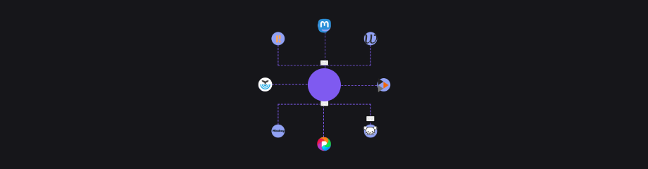

# JoinTheFediverse.net

Learn about the fediverse and find your new community.
## Development

This project uses node 18.13.0.

```sh
#install dependencies
npm install

# start development server
npm start dev
```

Note that there is an [open ticket](https://github.com/jointhefediverse-net/jointhefediverse.net/issues/13) to migrate the styles to SCSS, which will also require adding a build step.

## Translation

Before you begin translating the site:

- Please check if someone is [already working on a translation into your language](https://github.com/jointhefediverse-net/jointhefediverse.net/issues?q=is%3Aopen+is%3Aissue+sort%3Aupdated-desc+label%3Atranslation).
- If there is an open ticket with your language, feel free to leave a comment if you'd like to join in.
- If not, [please reach out](https://stefanbohacek.com/contact/) first so that we can open a new translation ticket to keep track of any ongoing work.

The current translation workflow is described below. If you don't have a GitHub account, or prefer not to use it, feel free to follow steps 1 through 4 and send the translated files [via email](https://stefanbohacek.com/contact/).

Otherwise, you can [fork this repo](https://docs.github.com/en/get-started/quickstart/fork-a-repo), make the necessary changes, and open a pull request.

1. Note the [language code](https://www.ibm.com/docs/en/datacap/9.1.8?topic=support-supported-language-codes) for the language you'd like to translate. This will be your "locale".
2. Navigate to the `translations` folder.
3. Make a copy of the `en-us.json` file and `en-us` folder. Rename these to match your locale, in lower case.
4. Update the `.json` file for your locale.

```js
{
    "label": "Native name of the language",
    "label_lat": "latinized native name of the language, this is used for sorting",
    "label_en": "English name of the language",
    "lang_dir": "the direction of the languaue, LTR (left-to-right) or RTL (right-to-left)",
    "available": true, // Should the language be visible in the language picker? true or false
    "translators": [ // List of people who contributed to the translation
        {
            "name": "Person A",
            "url": "https://example.social/@person_a"
        },
        {
            "name": "Person B",
            "url": "https://example.social/@person_b"
        }
    ]
}
```

Please note that `label_lat` should be a latinized (or transliterated) version of the English name of the language. This is needed for a more natural alphabetical sorting in the language picker menu. For example, for Spanish:

```json
"label": "Español",
"label_lat": "espanol",
"label_en": "Spanish",
```

5. Translate each file inside your locale folder.

If you're working with a local copy of the site, you will need to [install node](https://nodejs.org/en/download) and run `npm run translate` to compile  translation files inside the `locales` directory. These files are not committed to the repo and will be generated during site deployment. 

Keep in mind that the goal is to [communicate the same ideas to an audience in a different culture](https://localizejs.com/articles/what-is-the-difference-between-translation-and-localization/). For example, in this sentence:

> You're probably using Gmail. Or perhaps Outlook. Or Yahoo Mail.

Consider listing services that are popular in your particular country.

> Pravdepodobne používaš Gmail. Alebo Zoznam.sk. Možno Centrum.sk.
